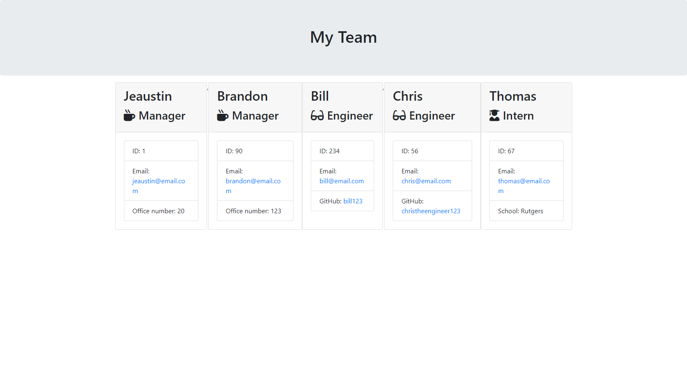

  # Team Profile Generator

  ## Description
This project is a Node.js command-line application that takes in information about employees on a software engineering team, then generates an HTML webpage that displays summaries for each person.

  ## Table of Contents
  * [Project Links](#links)
  * [Usage](#usage)
  * [Screenshots](#screenshots)
  * [Credits](#credits)
  * [License](#license)
  * [Contributing](#contributing)
  * [Tests](#tests)
  * [Questions](#questions)

  ## Links
  * [Demo](https://drive.google.com/file/d/1qiyu4qXAin6j3v4rNRIZrXlbcu0M_mtr/view)
  * [GitHub Repo](https://github.com/jeaustins27/Team-Profile-Generator)

  ## Usage
To get started, clone the repo onto your machine. Once cloned, run "npm install" in the command line to install the required packages. To start, run "node app.js" to begin the prompt. Answer the prompts in the command line, to choose roles, use the arrow keys. Once you are satisfied with the amount of employees generated the program will generate an HTML with the team.

  ## Screenshots
  

  ## Credits
  * [W3Schools](https://www.w3schools.com/)
  * [Readme.so](https://readme.so/)
  * [Stack Overflow](https://stackoverflow.com)

  Starter code was provided by my instructor, Kevin Ferguson.

  
  ## License
  
  
  This project is licensed under the [MIT](https://choosealicense.com/licenses/mit/) license.

    

  ## Contributing
  You can help with contributing by reaching me via email.

  ## Tests
  To run a test, run "npm run test" in the command line.

  ## Questions
  If you have any questions you can reach out via [Email](mailto:JeaustinS27@gmail.com) or you can check out my GitHub profile at here: [GitHub](https://github.com/jeaustins27)
